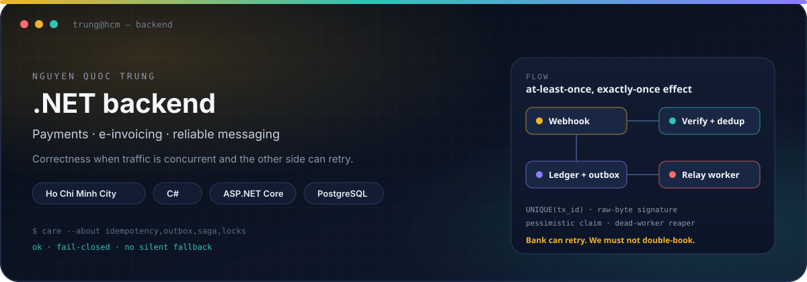
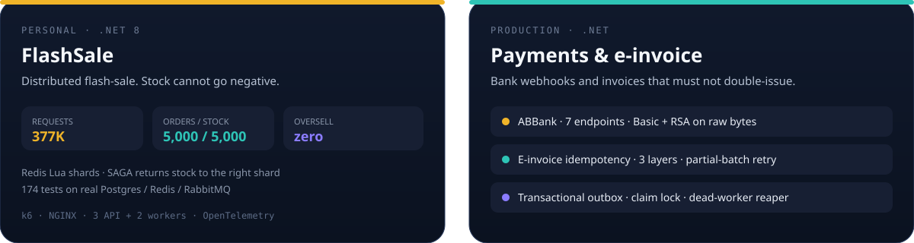
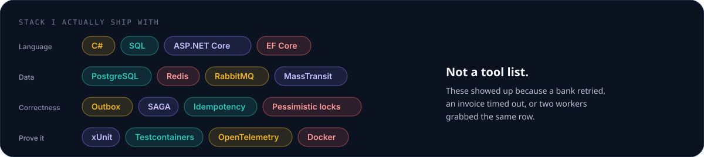

<!-- github.com/trungquocnguy -->

  

 

Backend .NET ở **TP. Hồ Chí Minh**. Việc hàng ngày của tôi là không để tiền, hóa đơn, tồn kho bị ghi hai lần khi bank retry, worker chết, hoặc request timeout.

I write the path that must stay correct when the other side retries.

 

  

 

  

 

### How I usually work

- **Fail closed.** A missing signature or a dead cache is an error, not a guess. Fallback that “helps” has already issued the wrong QR.
- **Effect, not intent.** At-least-once delivery is fine if the write is idempotent and the ledger is the only book.
- **Measure the constraint.** If `/health/live` falls over, you are saturating the box, not the algorithm.

Featured repos stay private for now. If you are hiring, ask — I will walk the code.

---

  
  

  Ho Chi Minh City · open to .NET backend roles

